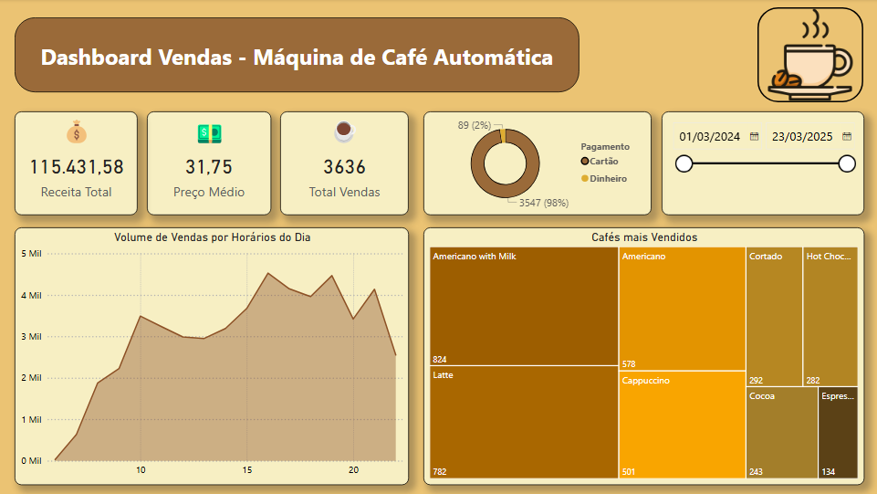
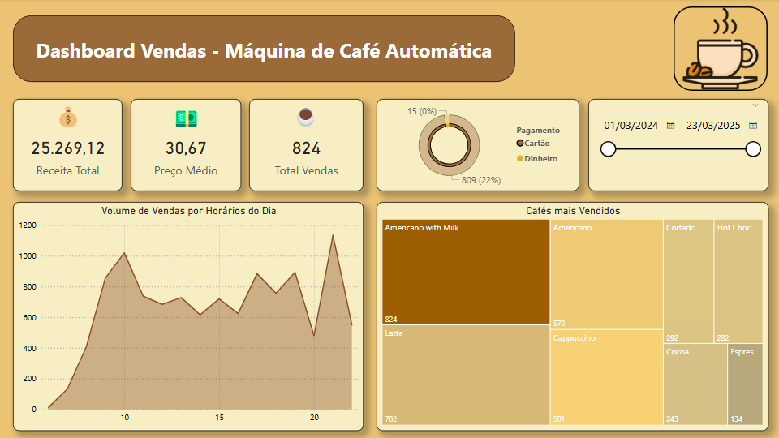
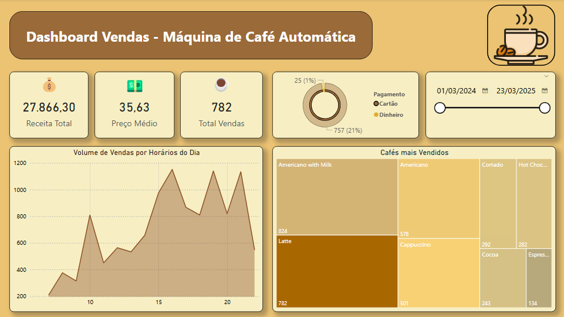
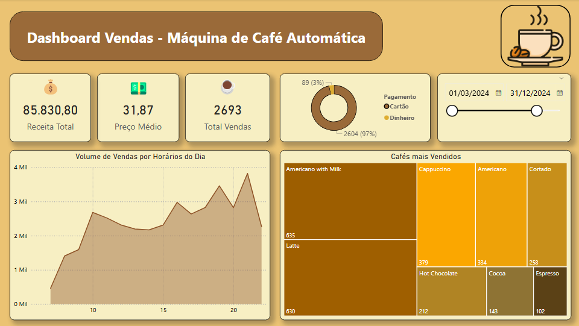
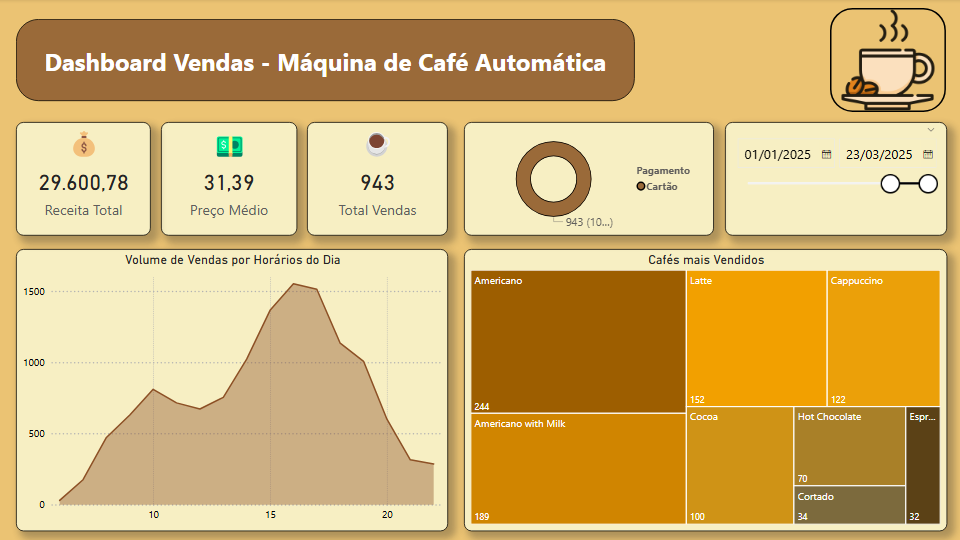

# Dashboard Vendas - Máquina de Café Automática

Dashboard desenvolvido no **Power BI** para análise de vendas de uma máquina de café automática instalada em um shopping center em **Vinnytsia, Ucrânia**.

Os valores monetários estão em **hrívnia ucraniana (UAH)**.

---

## 📊 Visão Geral

O dashboard apresenta os principais indicadores de vendas com filtro interativo por período (slider de datas), permitindo análises comparativas por café, horário e ano.

### Indicadores principais

- **Receita Total** — soma de todas as vendas no período selecionado
- **Preço Médio** — valor médio por venda em UAH
- **Total Vendas** — quantidade total de cafés vendidos

### Visuais

- **Treemap — Cafés mais Vendidos:** exibe os tipos de café rankeados por volume de vendas, com destaque proporcional para os mais populares
- **Gráfico de Área — Volume de Vendas por Horários do Dia:** mostra os picos de consumo ao longo do dia, revelando os horários de maior movimento

---

## Filtro por Período

O dashboard conta com um **filtro de data interativo (slider)** no canto superior direito, que permite selecionar qualquer intervalo dentro do período disponível (01/03/2024 a 23/03/2025). Todos os visuais e KPIs atualizam dinamicamente conforme o período escolhido.

---

## 🔍 Filtros

### Americano with Milk — O mais vendido em quantidade

O **Americano with Milk** é o café com maior volume de vendas no período total (824 unidades). Seu padrão de consumo mostra dois picos bem definidos: **próximo às 10h da manhã** e novamente **às 22h da noite**, sugerindo um perfil de consumidor que o consome tanto no início do dia quanto no fim da noite.

---

### Latte — Maior receita entre os filtrados

O **Latte**, apesar de ser o segundo colocado em volume de vendas (782 unidades), gerou **receita total maior do que o Americano with Milk** em UAH, evidenciando seu preço médio mais elevado. Seu consumo é concentrado a partir das **15h até o período noturno**, com um perfil de consumidor bem diferente do café mais vendido.

---

### Ano 2024

Período de **01/03/2024 a 31/12/2024**. Com 2.693 vendas e receita total de 85.830,80 UAH, o ano de 2024 apresenta o **Americano with Milk** como líder de vendas, com picos de volume expressivos ao longo do dia.

---

### Ano 2025

Período de **01/01/2025 a 23/03/2025**. Com 943 vendas e receita de 29.600,78 UAH, o ano de 2025 traz uma mudança no ranking: o **Americano** passa a liderar em volume, e o padrão de horários apresenta um pico mais concentrado entre **15h e 17h**.

---

## Ferramentas

- Power BI Desktop
- Dataset: Coffee Sales — [Kaggle](https://www.kaggle.com/datasets/ihelon/coffee-sales)

---

## 📧 Contato

**Vitor Fernando Pires Alves**  
- **Email:** vitor.fpiresalves@gmail.com
- **LinkedIn:** [linkedin.com/in/vitor-pires-alves](https://www.linkedin.com/in/vitor-pires-alves/)
